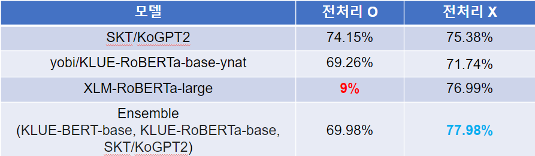
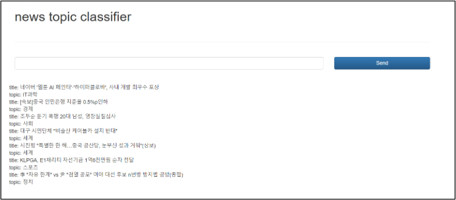

## 뉴스 토픽 분류

#### Summary

- 뉴스 헤드라인을 보고 해당 뉴스의 토픽을 분류하는 알고리즘 개발 후 웹으로 서비스
- 맡은 역할
  - 데이터 전처리 
  - KLUE-RoBERTa-large, yobi/klue-roberta-base-ynat 모델 학습
  - 모델 성능 결과 분석
  - ppt 제작 및 프로젝트 발표

### 과정

1. 데이터 수집
   - 뉴스 헤드라인과 토픽(정치, 경제, 사회 등 총 7개)으로 구성
   - KLUE topic classification의 약 45000개 + 네이버 뉴스에서 직접 크롤링한 데이터 약 95000개
     총 140773개의 데이터
   
2. 데이터 전처리
   - 중복 제거
   - 자주 등장하는 한자 및 영문자
   - 특수문자, 숫자 및 기호는 공백(" ")문자로 대체
   - 다운샘플링으로 토픽 분포 균일화
   
3. 모델 훈련

     - Huggingface를 이용해 여러 BERT 사전학습 모델들을 파인튜닝 한 뒤 가장 좋았던 모델로 분류기 구현
     - 데이터 전처리가 성능증가에 도움이 됐는지 확인하기 위해 전처리 전, 후 데이터로 각각 훈련시켜서 정확도 비교도 실험
     - 사용모델
       1) XLM-RoBERTa-large
       2) yobi/klue-roberta-base-ynat
       3) SKT/KoGPT2
       4) BERT 앙상블 (KLUE-BERT-base, KLUE-RoBERTa-base, SKT/KoGPT2)
     
4. 모델 성능 분석

     - 모두 동일한 데이터로 새로 크롤링해 성능테스트 진행
     - 

     

### 결과

- 성능이 제일 좋았던 Ensemble 모델로 분류기 구현
- ~~Colab과 연동해 웹서비스~~ 현재는 중단
- 

### 분석

1. 전처리는 도움이 됐는가?
   => 전처리하지 않은 데이터로 학습 시 더 성능이 좋은 결과
   => 사전학습 모델의 사전에 전처리 대상이 되는 한자나 영단어 등이 이미 등록되어 있어 이를 한글로 변환시 다른 벡터로 임베딩됨

​	ex) "美, B-52 전략폭격기 호주에 배치 계획"  => "미국, B-52 전략폭격기 호주에 배치 계획"
​	 => '美 : 466'으로 임베딩 됐어야할 한자가 '미국' 한글로 변환되면서 3666 되어버리면서 원래 문장과 다른 의미	를 갖게 될 수도 있음

2. 데이터 문제

   - Label이 이상한 경우

   - Label이 중의적인 경우

   => 위와 같은 경우들이 있어 데이터에 품질에 대해 생각해 보아야함

정리하면,

- Garbage in, garbage out이라는 말처럼 프로젝트 의도에 맞는 데이터를 수집하는게 중요
- 오히려 전처리가 모델의 성능을 저하시킬 수 있기 때문에 전처리 방식도 고민해봐야 한다

